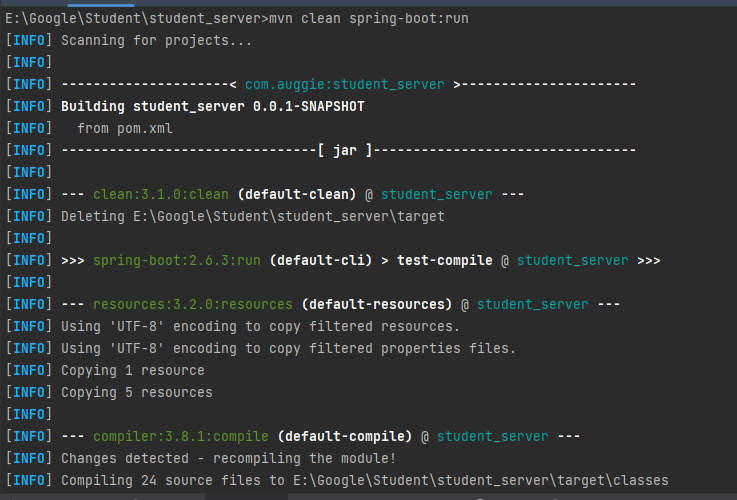
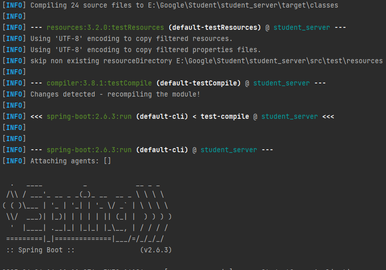
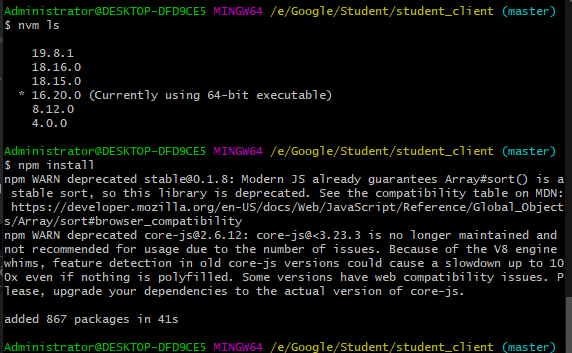
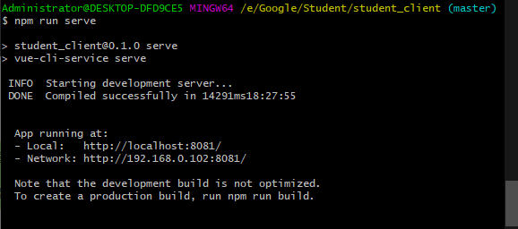

<p align="center"><a href='https://docs.oracle.com/en/java/javase/8'>
</a>
    <a href='https://docs.spring.io/spring-boot/docs/2.6.2-SNAPSHOT/reference/html'>

</a>
    <a href='https://staging-cn.vuejs.org'>

</a><br/>
    <a href='#'></a>
    <a href='#'></a>
    <a href='#'></a>
    <a href='#'></a>
</p>

# 学生选课管理系统

#### 开发环境
Windows

#### 配置环境

| 程序           | 版本        | 说明                       |
|--------------|-----------|--------------------------|
| Jdk          | 1.8.0 161 | Java 开发工具包               |
| Mysql        | 5.5.27    | 关系型数据库                   |
| Apache-maven | 3.9.0     | Java 项目管理和构建工具           |
| Nvm          | 1.10      | Node.js 版本管理器            |
| Node         | 8.12.0    | Node.js JavaScript 运行时环境 |

#### 开发工具

| 工具                       | 版本            | 说明                      |
|--------------------------|---------------|-------------------------|
| IDEA                     | 2022.3.2      | 后前端开发IDE                |
| Git                      | 2.24.1        | 代码托管平台                  |
| Google   Chrome          | 75.0.3770.100 | 浏览器、前端调试工具              |
| Navicat                  | 11.1.13       | 数据库连接工具                 |
| Postman                  | 7.1.0         | 接口测试工具                  |
| VMware   Workstation Pro | 14.1.3        | 虚拟机(未用到或许你会用到)          |
| PowerDesigner            | 15            | 数据库设计工具(未用到或许你会用到)      |
| SQLyog                   | 12.0.3        | 数据库连接工具 (未用到或许你会用到)     |
| Visio                    | 2013          | 时序图、流程图等绘制工具(未用到或许你会用到) |
| ProcessOn                | ——            | 架构图等绘制工具(未用到或许你会用到)     |
| XMind   ZEN              | 9.2.0         | 思维导图绘制工具(未用到或许你会用到)     |
| RedisDesktop             | 0.9.3.817     | redis客户端连接工具(未用到或许你会用到) |

#### 编码规范

- 规范方式：严格遵守阿里编码规约。
- 命名统一：简介最大程度上达到了见名知意。
- 分包明确：层级分明可快速定位到代码位置。
- 注释完整：描述性高大量减少了开发人员的代码阅读工作量。
- 工具规范：使用统一jar包避免出现内容冲突。
- 代码整洁：可读性、维护性高。

#### 包的结构
```
 +- student_server -- 服务端
    +- src
    |   +- main
    |   |    +- java
    |   |    |    +- com
    |   |    |    |    +- augie
    |   |    |    |    |    +- student_server
    |   |    |    |    |    |    +- controller -- 控制器类 负责接收和处理HTTP请求
    |   |    |    |    |    |    +- entity -- 实体类
    |   |    |    |    |    |    +- mapper -- MyBatis框架的数据访问层
    |   |    |    |    |    |    +- service -- 服务类 程序的业务逻辑 与控制器类和数据访问层的服务交互
    |   |    |    |    |    |    +- StudentServerApplication.java -- 应用程序入口类
    |   |    +- resources
    |   |        +- mapper -- MyBatis Mapper XML文件 数据库访问
    |   |        +- application.yml -- 应用程序的配置信息
    |   +- test
    |  	|	+- java -- 测试代码
    +- target -- Maven建项目时自动生成的目录
    +- 数据库脚本
    +- .gitignore -- 指定需要 Git 忽略的文件或目录
    +- LICENSE -- 开源软件的授权协议
    +- pom.xml -- 
    +- README.en.md -- 项目的相关信息文档 英文
    +- README.md -- 项目的相关信息文档
 +- student_client -- 客户端
     +- public -- 公共的静态资源文件夹 不需要经过 Webpack 打包处理
        +- favicon.ico -- 网站的图标
        +- index.html -- 项目的默认页面 整个应用的入口页面
     +- src
        +- assets -- 静态资源文件 如图片、字体等
        +- components -- Vue 组件
        +- plugins -- 插件
        +- router -- 路由配置
        +- store -- Vuex 状态管理模式
        +- views -- 页面级组件
        +- App.vue -- 根组件 协调整个应用程序的视图和管理应用程序的状态
        +- main.js -- 项目的入口文件
     +- .gitignore -- 指定需要 Git 忽略的文件或目录
     +- babel.config.js -- 配置 Babel 编译器的 JavaScript 配置文件
     +- LICENSE -- 开源软件的授权协议
     +- packge.json -- 项目元数据的文件 用于描述 Node.js 应用程序或模块的属性
     +- packge-lock.json -- 锁定当前安装的包的版本号和依赖关系
     +- READE.md -- 项目的相关信息文档
```
#### 后端技术栈

| 技术                          | 版本    | 说明                                            |
|-----------------------------|-------|-----------------------------------------------|
| spring-boot-starter-web     | 未指定   | Spring Boot Web 框架的基础组件                       |
| mybatis-spring-boot-starter | 2.2.2 | MyBatis 和 Spring Boot 的集成组件                   |
| mysql-connector-java        | 未指定   | MySQL 数据库驱动                                   |
| lombok                      | 未指定   | Java 实体类代码简化工具                                |
| spring-boot-maven-plugin    | 未指定   | Spring Boot Maven 插件，用于打包和运行 Spring Boot 应用程序 |
#### 前端技术栈

| 技术                     | 版本      | 说明                      |
|------------------------|---------|-------------------------|
| core-js                | ^3.6.5  | JavaScript 标准库          |
| element-ui             | ^2.4.5  | 基于 Vue.js 的组件库          |
| vue                    | ^2.6.11 | 渐进式 JavaScript 框架       |
| vue-router             | ^3.2.0  | Vue.js 的官方路由管理器         |
| vuex                   | ^3.4.0  | Vue.js 的官方状态管理库         |
| @vue/cli-plugin-babel  | ~4.5.0  | Vue CLI 的 Babel 插件      |
| @vue/cli-plugin-router | ~4.5.0  | Vue CLI 的路由插件           |
| @vue/cli-plugin-vuex   | ~4.5.0  | Vue CLI 的 Vuex 插件       |
| @vue/cli-service       | ~4.5.0  | Vue CLI 的核心服务           |
| axios                  | ^0.18.0 | 基于 Promise 的 HTTP 库     |
| vue-cli-plugin-axios   | ^0.0.4  | Vue CLI 的 Axios 插件      |
| vue-cli-plugin-element | ^1.0.1  | Vue CLI 的 Element UI 插件 |
| vue-template-compiler  | ^2.6.11 | 编译 Vue.js 模板的编译器        |

#### 安装教程
- 1.数据库：在navicat中运行数据库脚本生成对应的数据库表
- 2.后台启动：导入项目，在src/main/resources/application.yml文件里更改数据库名称或数据库密码,进入控制台，到项目所在路径，执行命令：mvn clean spring-boot:run
- 3.前台启动：导入项目，进入控制台，到项目所在路径，执行命令：npm install 后 npm run serve，访问对应的地址进入到登录界面
- 4.登录用户名密码如下

```
用户id:1
用户密码：1234
用户类型: 学生

用户id:4
用户密码：1234
用户类型: 教师

admin登录有bug
```







